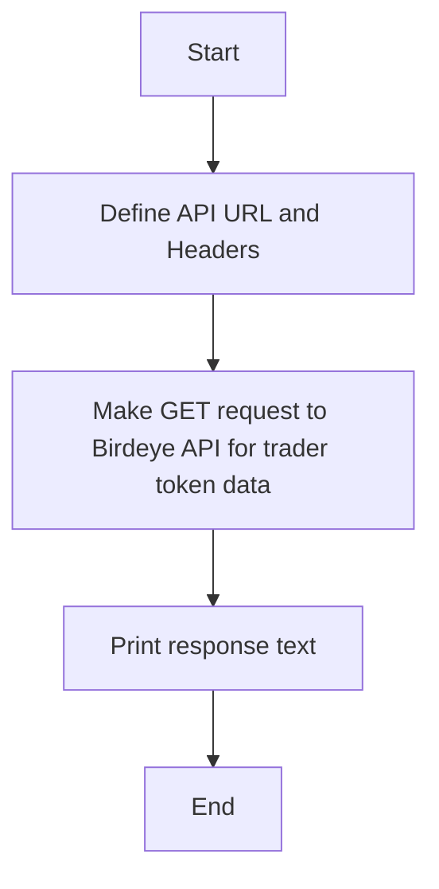
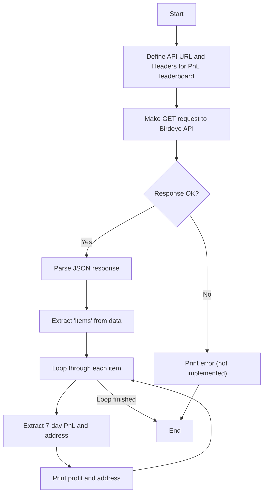
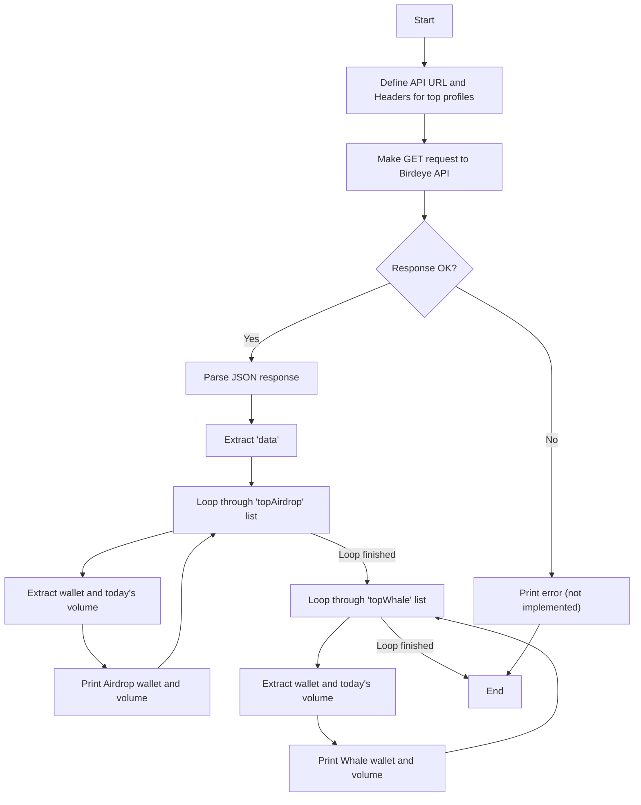
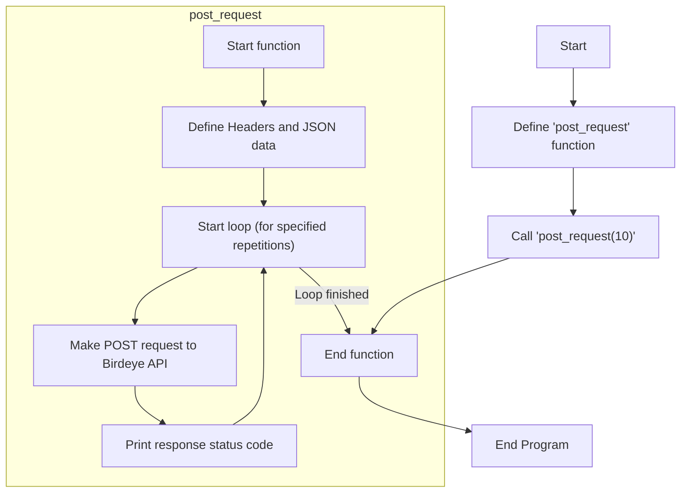

# Birdeye API Scripts

This project contains a collection of Python scripts that interact with the Birdeye.so API to fetch various cryptocurrency-related data. Each script is designed to be run independently and demonstrates a specific API endpoint.

## Table of Contents
- [Project Overview](#project-overview)
- [File Explanations](#file-explanations)
  - [`main.py`](#mainpy)
  - [`pnl.py`](#pnlpy)
  - [`top_profiles.py`](#topprofilespy)
  - [`post.py`](#postpy)
- [Setup and How to Run](#setup-and-how-to-run)
- [Important Notes](#important-notes)

## Project Overview

The scripts in this repository showcase how to retrieve data from Birdeye's multi-chain API. The examples include fetching trader information, profit and loss leaderboards, top profiles (whales and airdrop recipients), and sending POST requests for transaction data.

## File Explanations

### `main.py`

This script performs a simple GET request to a hardcoded Birdeye API endpoint to fetch trader data for a specific token on the Solana blockchain.

**Flowchart:**



### `pnl.py`

This script fetches the top 7-day gainers from the Birdeye PnL leaderboard. It parses the JSON response and prints the profit and wallet address for each trader in the list.

**Flowchart:**



### `top_profiles.py`

This script retrieves information about top profiles on Birdeye, specifically focusing on "Top Airdrop" recipients and "Top Whales". It then prints the wallet address and today's trading volume for each profile in both categories.

**Flowchart:**



### `post.py`

This script demonstrates how to send POST requests to the Birdeye API. It contains a function that repeatedly sends a request for token transaction data and prints the HTTP status code of the response. The script is set to make 10 requests.

**Flowchart:**



## Setup and How to Run

### Prerequisites

- Python 3.x
- `pip` for package installation

### Installation

The scripts use the `curl_cffi` library to make HTTP requests, as it can impersonate browser TLS fingerprints. Install it using pip:

```bash
pip install curl_cffi
```

### Running the Scripts

Each script can be run directly from the terminal.

```bash
# To run the main script
python main.py

# To run the PnL script
python pnl.py

# To run the top profiles script
python top_profiles.py

# To run the post request script
python post.py
```

## Important Notes

- **Hardcoded Values**: All scripts contain hardcoded API URLs and headers. These might need to be updated if the Birdeye API changes.
- **Expired JWT in `post.py`**: The `post.py` script contains a hardcoded `cf-be` JWT in the headers. This token is likely expired and will need to be replaced with a valid one for the request to succeed. You would typically obtain this by observing the network requests in your browser when using the Birdeye website. 